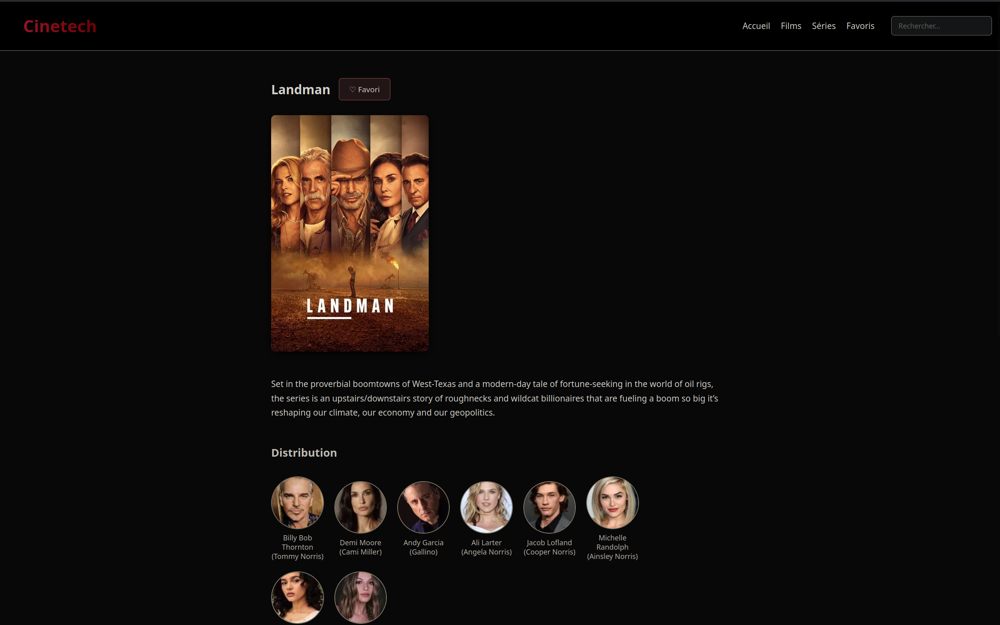

# CineTech

A web application for browsing movies and TV series using The Movie Database (TMDB) API.

## Demo

### Homepage


### Details Page




## Setup

### API Key Configuration

This project uses the TMDB API to fetch movie and TV series data. To set up your own API key:

1. **Get a TMDB API Key**:
   - Sign up at [The Movie Database](https://www.themoviedb.org/)
   - Go to your [API settings](https://www.themoviedb.org/settings/api)
   - Request an API key (it's free!)

2. **Configure the API Key**:
   ```bash
   # Copy the example config file
   cp js/config.example.js js/config.js
   ```

3. **Add Your API Key**:
   - Open `js/config.js`
   - Replace `YOUR_TMDB_API_KEY_HERE` with your actual API key

4. **Important**: The `js/config.js` file is gitignored and should never be committed to the repository to keep your API key secure.

## Running the Project

Simply open `index.html` in your web browser. Make sure you've configured your API key as described above.

## Project Structure

- `index.html` - Main homepage
- `movies.html` - Movies listing page
- `series.html` - TV series listing page
- `detail.html` - Detail page for movies/series
- `favorites.html` - User's favorite items
- `js/` - JavaScript modules
  - `config.js` - API configuration (gitignored)
  - `config.example.js` - Example config template
  - `api.js` - API service functions
  - `ui.js` - UI rendering functions
  - `main.js` - Main application logic
  - Other modules...
- `css/` - Stylesheets

## Security Note

Never commit your actual API key to version control. Always use the `config.js` file which is included in `.gitignore`.
